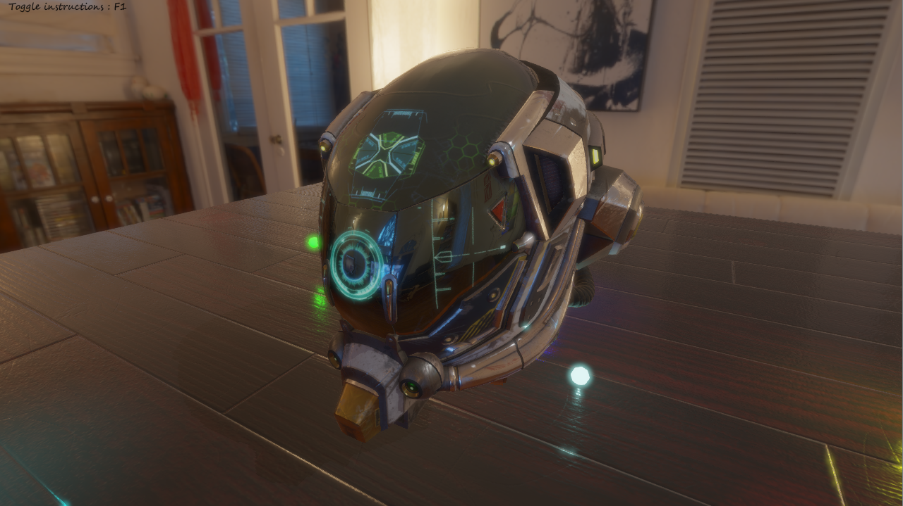
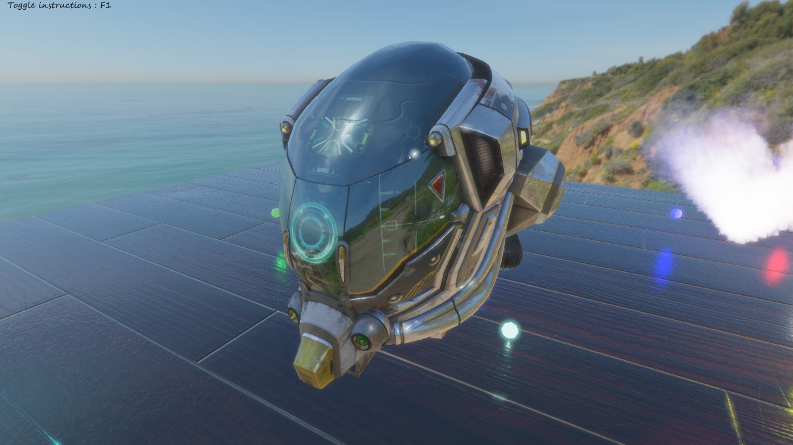

# Deferred Renderer Sample

This project demonstrate the use of the PBR deferred renderer.

It displays a simple scene containing a few models, an environment map, and some analytical lights. The scene is 
contained in the /scenes/demo_scene.json resource file.

# Screenshots

## Low natural light scene

## High natural light scene and lit particles

